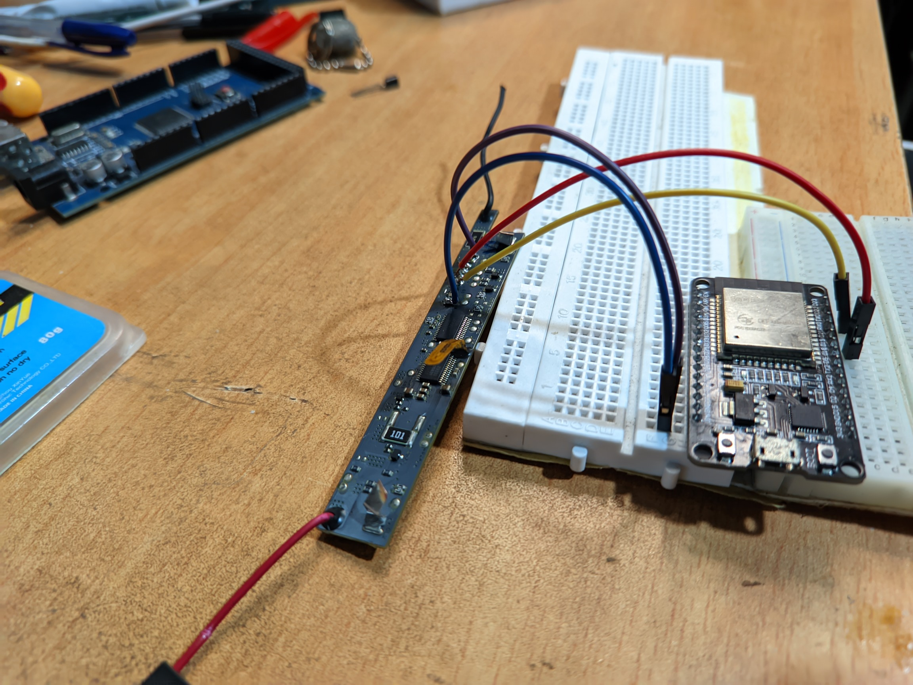
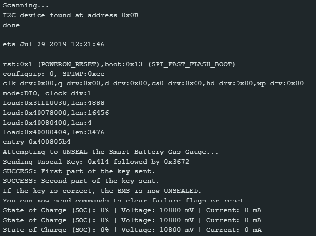
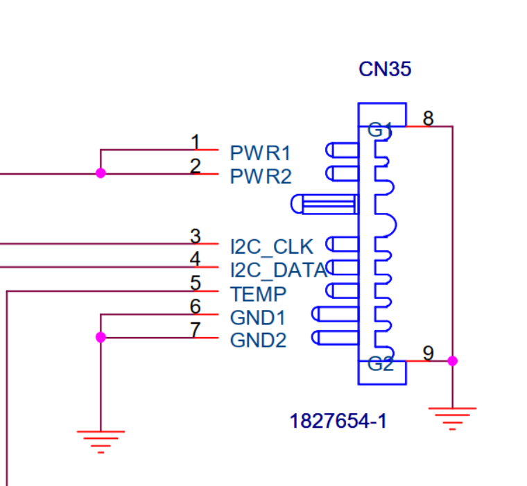
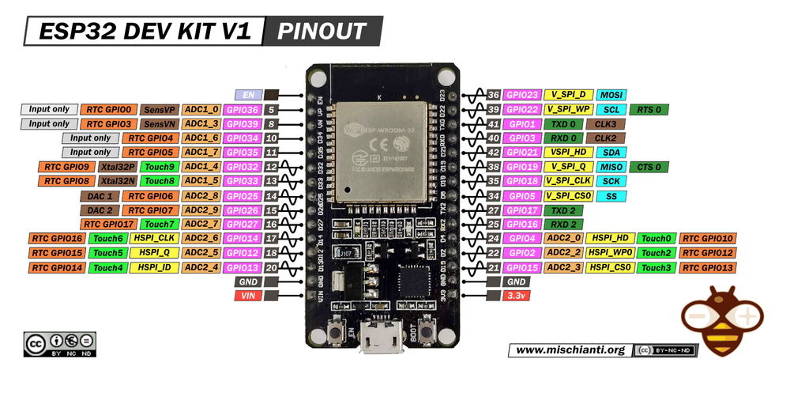

# Unlocking and Reviving a Lenovo L09N6D16 Laptop Battery

This project documents the process of unlocking a "bricked" Lenovo L09N6D16 laptop battery using an ESP32. The battery was electronically locked by its Battery Management System (BMS) but was chemically still viable. This guide covers the hardware setup, communication protocol, and the code required to clear the fault flags and prepare the BMS for new cells.

---

## The Problem

Many laptop batteries are discarded not because the cells are dead, but because the internal BMS has entered a permanent failure (PF) state due to a fault condition (like a cell reaching a critically low voltage). This project aims to reverse that state, promoting the #RightToRepair and reducing e-waste.

---

## Hardware Used

* **Microcontroller:** ESP32 DevKitC
* **Battery Model:** Lenovo L09N6D16 (57Wh)
* **BMS Gas Gauge IC:** (Likely a bq-series chip, communicates at I2C address `0x0B`)
* **Replacement Cells:** 6 x Samsung INR18650-35E (3500mAh)
* **Power Supply:** Separate 5V power supply for the BMS and a bench power supply for charging.
* **Tools:** Jumper wires, breadboard, spot welder (or cells with pre-welded tabs).

---

## The Process

The core of the project is communicating with the BMS over SMBus (an I2C protocol) to send specific unseal and reset commands.

The project was broken down into three distinct stages, with a separate Arduino sketch for each step.

### Step 1: Find the BMS (`scan.ino`)
The first challenge was to establish communication. The bq29330 datasheet suggested an I2C address of `0x20`, but communication failed. Running the `scan.ino` sketch revealed the correct address of the main gas gauge IC was **`0x0B`**.

### Step 2: Unseal the Security Lock (`unseal.ino`)
With the correct address, the `unseal.ino` script sends a two-part security key (`0x0414` and `0x3672`) to the `ManufacturerAccess` register (`0x00`). This command takes the BMS out of its "SEALED" state, allowing further commands to be accepted.

### Step 3: Clear Faults and Reset (`reset.ino`)
Once unsealed, the `reset.ino` script performs the final unlock:
1.  **Clears Permanent Failure (PF) Flags:** Sends another two-part key (`0x4172` and `0x4436`) to clear the locked state.
2.  **Resets the BMS:** Sends a reset command (`0x0041`) to apply the changes and reboot the chip into a normal operating mode.

After this final step, the BMS began reporting live voltage data, confirming it was fully unlocked and functional.

---

## Hardware and Wiring

* **Microcontroller:** ESP32 DevKitC
* **Battery Model:** Lenovo L09N6D16 (57Wh)
* **Wiring:**
    * **ESP32 `Vin`** -> BMS `PWR1 or PWR2` pin
    * **ESP32 `GPIO 21` (SDA)** -> BMS `I2C_DATA` pin
    * **ESP32 `GPIO 22` (SCL)** -> BMS `I2C_CLK` pin
    * **ESP32 `GND`** -> BMS `GND` pin
    * A **common ground** was established between the ESP32 and the separate 5V supply powering the BMS.
 

---

## ⚠️ Safety Warning

Working with Lithium-ion batteries is dangerous.
* Never use damaged or low-voltage cells.
* Always use a proper battery spot welder or cells with pre-welded tabs. **Do not solder directly onto cells.**
* Never leave charging batteries unattended.
* Ensure correct polarity at all times to avoid short circuits.

---

## License

This project is open-source and licensed under the MIT License. See the `LICENSE` file for details.

